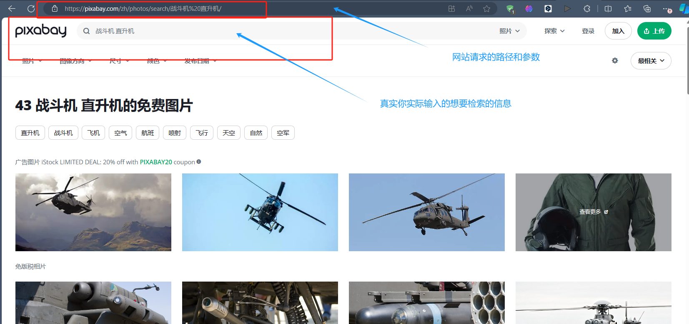
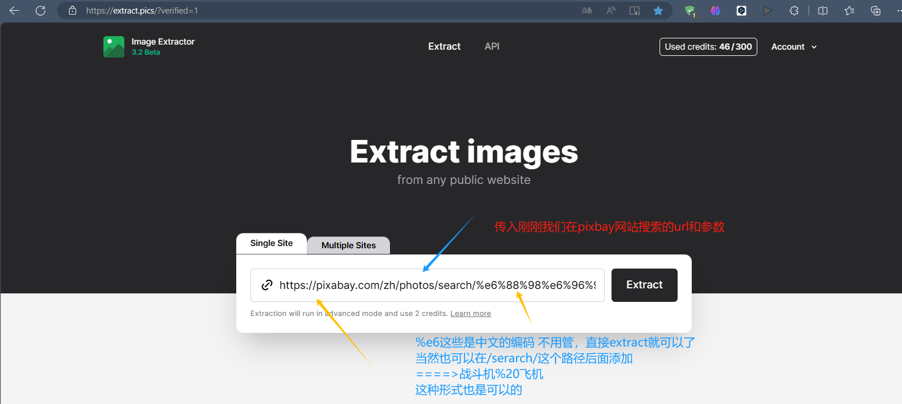
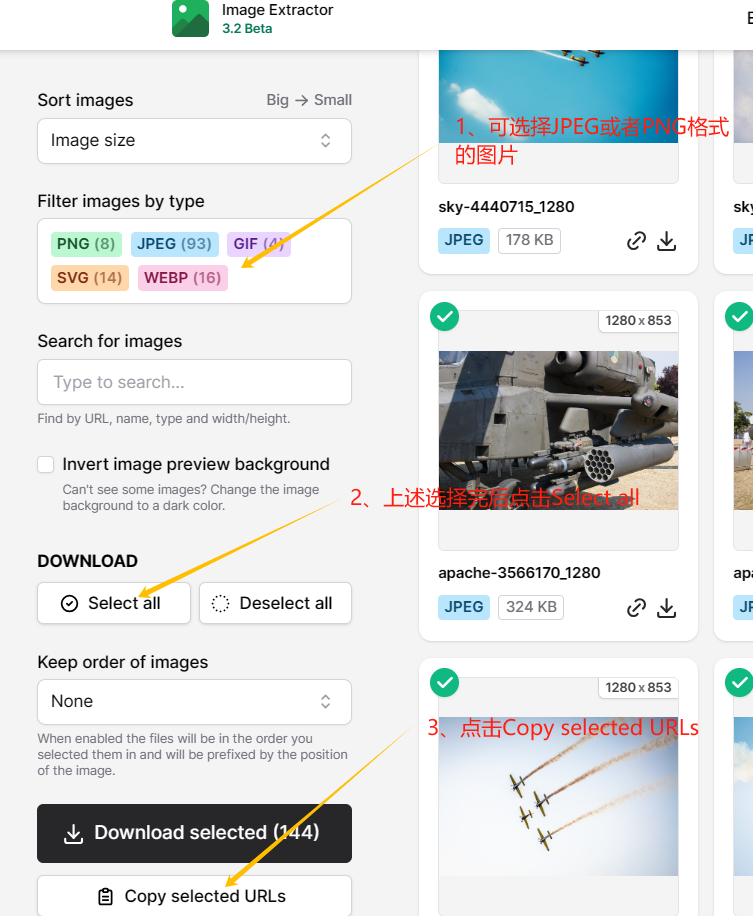
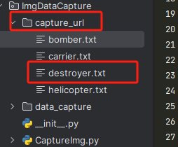
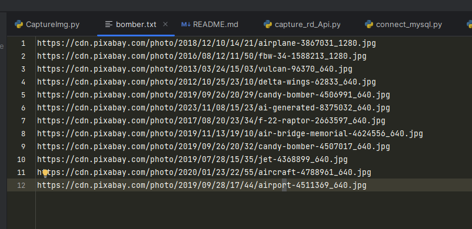
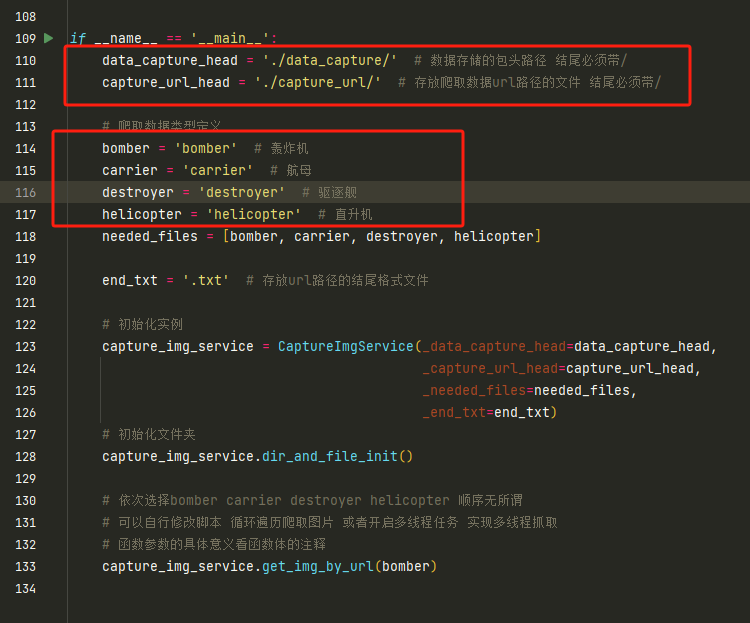

# Author: ZZGEDA Zhang Zan

# The required tech stack for the project:
* python  
* pandas
* urllib

# Project Architecture & Hierarchy Design
🎯🎯🎯🎯🎯🎯🎯🎯🎯🎯 🎯🎯🎯🎯🎯🎯🎯   

    ├─ImgDataCapture
    │  ├─capture_url        #Folder where the url of the captured image is stored.
    │  └─data_capture       #The folder where the crawled image is stored.
    │      ├─bomber         #Store images of bomber
    │      ├─carrier        #Store images of carrier
    │      ├─destroyer      #Store images of destroyer
    │      └─helicopter     #Holds the helicopter's image.
    ├─CaptureImg.py         #File entry for captured service

🚀🚀🚀🚀🚀🚀🚀🚀🚀🚀 🚀🚀🚀🚀🚀🚀🚀  

# Business requirements:
`file reading`: read the file in capture_url through pandas, convert it into DataFrame structure data to facilitate the subsequent logical operations
`capture images`: capture images from url addresses via urllib and write them locally.
👍👍👍👍👍👍👍👍👍👍👍👍👍👍👍👍👍  

# Goal implementation:  
##### 1, pandas read text text pieces ✔  
##### 2, use urllib to complete the network picture capturing ✔

# Scripts using the operation
### You can first look at the end, and then look at the specific realization here
### 1, in the relevant image retrieval site to complete the `keyword` search: for example, using https://pixabay.com/zh/photos/ to complete the image retrieval
! [img.png](README_Img/img.png)

👍👍👍👍👍👍👍👍👍👍👍👍👍👍👍👍👍  
### 2. Using the https://extract.pics/?verified=1 website, complete the image search and copy the url
! [img_2.png](README_Img/img_2.png)

👍👍👍👍👍👍👍👍👍👍👍👍👍👍👍👍👍  
### 3, select the desired retrieval images, left choose `DOWNLOAD` below choose `Select all`, and then click `Copy selected URLs` that can be
#### Note that you can choose to png, jpeg and other formats of the file Oh!
! [img_3.png](README_Img/img_3.png)

👍👍👍👍👍👍👍👍👍👍👍👍👍👍👍👍👍  
### 4, finally open the script file I prepared for you, create capture_url folder, and then create your own favorite name of the text file (.txt file), the above copy of the data directly paste it!
! [img_4.png](README_Img/img_4.png)
👍👍👍👍👍👍👍👍
! [img_5.png](README_Img/img_5.png)

### 5. Last step: go to the CaptureImg.py file and modify the appropriate variables and you're done! ❤😘😘😘😘😘😘😘
! [img_6.png](README_Img/img_6.png)

# end
    How about that, isn't that simple! This will allow you to crawl the images you want.
    This script is to help students who are relatively new to python or who want to simply play with captures to get started.
    Of course, you can use this script to efficiently retrieve and download the images you want.
    The prototype of the script is here, and it's up to you to play with it!
    ❤😘😘😘😘😘😘😘 🚀🚀🚀🚀🚀🚀  
    The possibilities are endless for everyone!!!
    (If the crawler process is not successful, you can try the "scientific Internet" way, pay attention to the use of transit nodes, if it is the form of IEPL may appear SSL authentication failure)

# 作者： ZZGEDA 张赞

# 项目所需的技术栈：
* python  
* pandas
* urllib

# 项目架构&层级设计
🎯🎯🎯🎯🎯🎯🎯🎯🎯🎯🎯🎯🎯🎯🎯🎯🎯   

    ├─ImgDataCapture
    │  ├─capture_url        #存放爬取图片url的文件夹
    │  └─data_capture       #图片爬取后存放的文件夹
    │      ├─bomber         #存放bomber的图片
    │      ├─carrier        #存放carrier的图片
    │      ├─destroyer      #存放destroyer的图片
    │      └─helicopter     #存放helicopter的图片
    ├─CaptureImg.py         #爬虫服务的文件入口

🚀🚀🚀🚀🚀🚀🚀🚀🚀🚀🚀🚀🚀🚀🚀🚀🚀  

# 业务需求：
`文件读取`：通过pandas读取capture_url中的文件，转换成DataFrame结构的数据方便后续的逻辑操作
`爬取图片`：通过urllib爬取url地址的图片，并写入本地
👍👍👍👍👍👍👍👍👍👍👍👍👍👍👍👍👍  

# 目标实现：  
#####  1、pandas读取文文本件 ✔  
#####  2、使用urllib完成网络图片的抓取 ✔

# 脚本使用操作
###  可以先看看结尾，再来看看这里的具体实现
###  1、在相关的图片检索网站完成 `关键字`的检索：举例使用 https://pixabay.com/zh/photos/ 完成图片检索

👍👍👍👍👍👍👍👍👍👍👍👍👍👍👍👍👍  
###  2、使用 https://extract.pics/?verified=1  网站，完成图片检索，并复制url

👍👍👍👍👍👍👍👍👍👍👍👍👍👍👍👍👍  
###  3、选择想要的检索图片，左侧选择  `DOWNLOAD` 下面选择  `Select all` ，然后点击 `Copy selected URLs` 即可
####    注意可以选择要png、jpeg等格式的文件哦

👍👍👍👍👍👍👍👍👍👍👍👍👍👍👍👍👍  
###  4、最后打开我给大家准备的脚本文件，创建capture_url文件夹，然后创建你自己喜欢名字的文本文件（.txt文件），将上述copy的数据直接粘贴就好了

👍👍👍👍👍👍👍👍

###  5、最后一步：进入CaptureImg.py 文件修改相应的变量就好了！！❤😘😘😘😘😘😘😘

# 结尾
    怎么样，是不是很简单！这样你就可以爬取到你想要的图片了。
    这个脚本是帮助对python比较陌生的同学或者是想简单玩玩爬虫的同学上手实践的。
    当然你可以合理使用此脚本高效的完成你想要的图片检索+下载操作。
    脚本的原型就在这里了，后续你要怎么操作就交给你发挥了！！
    ❤😘😘😘😘😘😘😘  🚀🚀🚀  
    大家都有无限可能！！！
    (如果爬虫过程中不成功的话可以试试”科学上网“的方式，注意使用中转节点，如果是IEPL的形式可能会出现SSL认证失败的情况)

